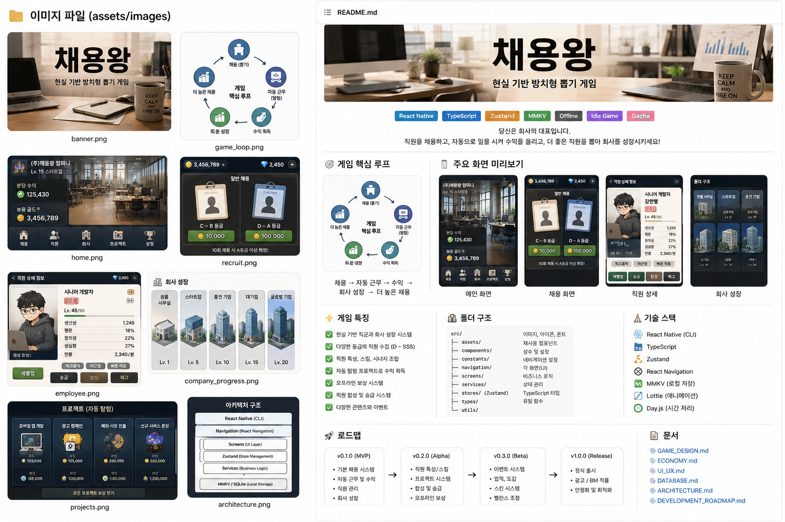

# 현실 기반 방치형 뽑기 게임 (Project Codename)

> **"좋은 직원을 뽑고, 더 큰 회사를 만든다."**



------------------------------------------------------------------------

# 1. Vision

판타지 대신 현실의 회사와 직장 생활을 소재로 한 방치형 수집 게임.

플레이어는 CEO가 되어 직원을 채용하고, 직원은 자동으로 프로젝트를 수행해
회사를 성장시킨다.

게임의 목적은 전투가 아니라 **더 좋은 뽑기를 하기 위한 성장**이다.

------------------------------------------------------------------------

# 2. Core Pillars

-   뽑기가 게임의 중심
-   현실적인 소재
-   짧은 플레이 + 긴 방치
-   낮은 등급도 끝까지 가치 있음
-   수집 욕구 자극

------------------------------------------------------------------------

# 3. Core Loop

``` text
채용
 ↓
직원 획득
 ↓
자동 근무
 ↓
골드 획득
 ↓
회사 업그레이드
 ↓
상위 채용 해금
 ↓
희귀 직원 획득
 ↓
반복
```

------------------------------------------------------------------------

# 4. MVP

## 필수

-   홈
-   채용
-   직원
-   프로젝트
-   회사 업그레이드
-   오프라인 보상
-   저장


------------------------------------------------------------------------

# 5. Screen Specification

## Home

-   회사 정보
-   분당 수익
-   자동 근무 상태
-   보상 받기
-   오늘의 미션

## Recruit

-   무료 채용
-   일반 채용
-   추천 채용
-   헤드헌팅
-   10연차
-   확률 보기

## Employees

-   리스트
-   필터
-   정렬
-   상세
-   합성

## Projects

-   진행 프로젝트
-   완료 시간
-   예상 수익

## Company

-   레벨
-   업그레이드
-   연구
-   인테리어

------------------------------------------------------------------------

# 6. Game Economy

Currency

-   Gold
-   Gem
-   Recruitment Ticket

Gold 사용처

-   채용
-   업그레이드

Gem 사용처

-   스킨
-   프리미엄 채용
-   편의 기능

------------------------------------------------------------------------

# 7. Recruitment

등급

D C B A S SS SSS

직원 구성

-   이름
-   직군
-   등급
-   생산성
-   행운
-   창의성
-   성실함
-   연봉
-   특성
-   스킬

------------------------------------------------------------------------

# 8. Progression

회사

원룸 → 공유오피스 → 스타트업 → 중견기업 → 대기업 → 글로벌 기업

프로젝트

쇼핑몰 → 앱 개발 → 게임 제작 → AI 플랫폼 → 글로벌 서비스

------------------------------------------------------------------------

# 9. Folder Structure

``` text
src/
 ├── assets/
 ├── components/
 ├── screens/
 ├── navigation/
 ├── store/
 ├── hooks/
 ├── services/
 ├── models/
 ├── constants/
 ├── utils/
 └── animations/
```

------------------------------------------------------------------------

# 10. Zustand Stores

-   authStore
-   playerStore
-   companyStore
-   employeeStore
-   recruitStore
-   projectStore
-   inventoryStore
-   settingStore

------------------------------------------------------------------------

# 11. Data Model

Employee

``` ts
id
name
grade
job
salaryPerMinute
productivity
luck
creativity
diligence
traits[]
skills[]
```

Company

``` ts
level
gold
gem
officeTier
incomePerMinute
employees[]
```

------------------------------------------------------------------------

# 12. Animation

Recruit

-   카드 등장
-   실루엣
-   등급 연출
-   캐릭터 등장

SSR 이상

-   화면 흔들림
-   빛
-   파티클
-   전용 BGM

------------------------------------------------------------------------

# 13. Balancing

초반

-   30초마다 채용

중반

-   2\~5분마다 의미 있는 성장

후반

-   장기 프로젝트
-   희귀 채용

------------------------------------------------------------------------

# 14. Monetization

-   광고 제거
-   월간 패스
-   스킨
-   추가 채용 슬롯
-   꾸미기

Pay-to-Win 지양

------------------------------------------------------------------------

# 15. Roadmap

## Alpha

-   자동 근무
-   채용
-   저장

## Beta

-   합성
-   회사 성장
-   프로젝트

## Release

-   이벤트
-   시즌
-   랭킹
-   도감

------------------------------------------------------------------------

# 16. TODO

-   [ ] 채용 시스템
-   [ ] 직원 생성기
-   [ ] 회사 성장
-   [ ] 프로젝트
-   [ ] 저장
-   [ ] 오프라인 보상
-   [ ] 밸런싱
-   [ ] 사운드
-   [ ] 연출
-   [ ] 테스트

------------------------------------------------------------------------

# 17. Design Principle

1.  뽑기가 가장 재미있어야 한다.
2.  전투보다 성장의 즐거움을 우선한다.
3.  현실적인 소재를 유쾌하게 표현한다.
4.  방치만 해도 성장하지만, 접속하면 더 재미있다.
5.  모든 시스템은 '더 좋은 채용'을 목표로 연결된다.
