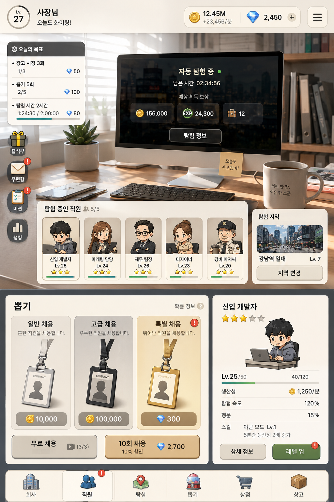
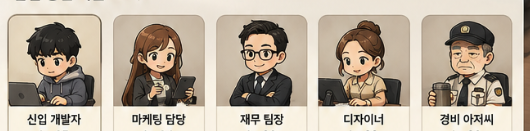

# 채용왕 (Project Codename)

> **좋은 직원을 뽑고 장착해, 더 많은 채용 자금을 만드는 현실 회사 테마 방치형 뽑기 게임**



---

## 1. 제품 방향

플레이어는 회사의 대표가 되어 다양한 직원을 채용하고 수집한다.
게임의 중심은 **직원 뽑기**이며, 좋은 직원을 획득하고 장착하는 것이 가장 중요한 목표다.

프로젝트 수행은 사용자가 직접 조작하거나 반복해서 파견하는 콘텐츠가 아니다.
장착한 직원들의 능력치에 따라 골드를 자동으로 생산하는 **자금 생성 시스템**이다.
획득한 골드는 다시 채용에 사용되어 더 좋은 직원을 얻는 데 쓰인다.

---

## 2. 핵심 재미

- 더 높은 등급의 직원을 뽑는 기대감
- 원하는 직군·능력치의 직원을 수집하는 만족감
- 좋은 직원을 장착했을 때 즉시 늘어나는 수익
- 수익 증가로 더 자주, 더 높은 등급의 채용을 할 수 있는 성장감

낮은 등급의 직원 활용, 합성, 연구, 인테리어, 랭킹 등은 핵심 루프가 검증된 뒤 추가한다.

---

## 3. 핵심 루프

```text
직원 뽑기
  ↓
좋은 직원 획득
  ↓
직원 장착 또는 교체
  ↓
장착 직원 능력치만큼 골드 자동 획득
  ↓
골드로 추가 채용
  ↓
더 좋은 직원 획득
  ↓
반복
```

---

## 4. MVP 범위

첫 검증 버전에서는 아래 세 화면과 하나의 자동 수익 시스템만 구현한다.

### Home

- 현재 골드
- 분당 수익
- 장착 중인 직원 (최대 5명)
- 자동 프로젝트 진행 상태
- 누적 보상 및 보상 받기
- 채용 화면, 직원 화면 이동

### Recruit

- 무료 채용
- 골드 채용
- 채용 결과
- 직원 등급별 결과 연출
- 채용 확률 정보

### Employees

- 보유 직원 목록
- 직원 상세 능력치
- 직원 장착·해제
- 장착 인원 최대 5명 제한
- 등급 및 생산성 기준 정렬

---

## 5. 자동 수익 시스템

프로젝트는 장착된 직원이 자동으로 수행한다. 사용자는 프로젝트를 직접 시작하거나 관리할 필요가 없다.

초기 검증에서는 직원의 `생산성`만 실제 수익 계산에 사용한다.

```text
분당 수익 = 장착 직원의 생산성 합계
```

- 장착 직원을 교체하면 분당 수익이 즉시 바뀐다.
- 앱이 종료된 동안에도 수익이 누적된다.
- 사용자가 홈에서 누적 골드를 수령한다.
- 오프라인 보상에는 추후 최대 누적 시간을 적용할 수 있다.

---

## 6. 직원과 채용

### 직원 데이터 (초기)

```ts
type Employee = {
  id: string;
  name: string;
  grade: 'D' | 'C' | 'B' | 'A' | 'S' | 'SS' | 'SSS';
  job: string;
  productivity: number;
};
```

### 채용 방식 (초기)

- 무료 채용: 일정 시간마다 가능
- 골드 채용: 골드를 소모해 즉시 가능
- 결과: 확률에 따라 직원 1명 획득

10연차, 추천 채용, 헤드헌팅, 젬 채용은 MVP 검증 후 추가한다.

---

## 7. 검증할 가설

이 MVP에서는 아래 질문에 답하는 것을 목표로 한다.

1. 사용자는 더 좋은 직원을 얻기 위해 반복 채용을 하고 싶어 하는가?
2. 더 좋은 직원을 얻었을 때 기존 직원을 교체·장착하고 싶어 하는가?
3. 수익 증가가 다음 채용을 위한 충분한 동기가 되는가?
4. 자동 수익을 수령하기 위해 다시 앱에 접속하는가?

---

## 8. MVP에서 제외하는 요소

- 회사 레벨 및 회사 업그레이드
- 지역 선택과 능동적 탐험·프로젝트 관리
- 직원 합성, 연구, 인테리어
- 랭킹, 길드, 친구
- 출석, 우편함, 일일 미션
- 광고 보상, 결제, 상점
- 로그인 및 서버 동기화

위 기능은 뽑기 → 장착 → 자동 수익 → 재채용 루프가 재미있다고 검증된 뒤 추가한다.

---

## 9. 초기 데이터 저장

서버 없이 기기 로컬 저장으로 시작한다.

```ts
type PlayerState = {
  gold: number;
  employees: Employee[];
  equippedEmployeeIds: string[];
  lastRewardClaimedAt: number;
  lastFreeRecruitAt: number | null;
};
```

앱 재실행 시 `lastRewardClaimedAt`과 현재 시각의 차이로 누적 수익을 계산한다.

---

## 10. 구현 순서

1. 등급별 채용 확률, 채용 비용, 생산성 범위를 정한다.
2. 로컬 저장을 포함한 플레이어·직원 상태를 만든다.
3. 직원 장착과 분당 수익 계산을 구현한다.
4. 자동 수익 및 오프라인 보상 계산을 구현한다.
5. 채용과 결과 화면을 구현한다.
6. 홈과 직원 화면을 연결하고 실제 플레이 흐름을 검증한다.
7. 검증 결과에 따라 채용 연출, 10연차, 추가 능력치와 부가 콘텐츠를 확장한다.

---

## 프롬프트

**캐릭터 생성**


```
Use case: stylized-concept
Asset type: square employee portrait for a Korean casual mobile idle management game

Input image:
Use the attached image only as a style reference.
Match its character design language: warm beige card-game mood, clean dark outlines, soft shading, rounded facial features, compact cute proportions, friendly Korean office-worker characters, and polished 2D mobile-game illustration quality.
Do not copy any existing character, pose, clothing, or composition from the reference image.

Primary request:
Create one new employee character: a Korean junior software developer.

Subject:
A friendly Korean man in his mid-20s with short, slightly tousled black hair.
He wears a dark charcoal hoodie over a light beige T-shirt.
He holds an open gray laptop naturally in front of his body with both hands.
The laptop screen contains only abstract colored lines and blocks, with no readable content.

Composition:
1:1 square image.
Single character only.
Waist-up employee portrait.
Character centered, facing slightly three-quarter toward the viewer.
Keep the head, shoulders, arms, hands, and entire laptop fully inside the frame.
Use comfortable empty margin around the character.
No employee card frame or UI.

Expression:
Gentle smile, quiet confidence, approachable and enthusiastic.

Background:
Perfectly flat solid #00FF00 chroma-key background for later removal.
No shadow, floor, environment, decoration, gradient, reflection, text, or particles.

Constraints:
Preserve the reference image's overall illustration style only.
No text, letters, numbers, logos, watermark, signature, or border.
Do not use #00FF00 in the character, clothing, or laptop.
```